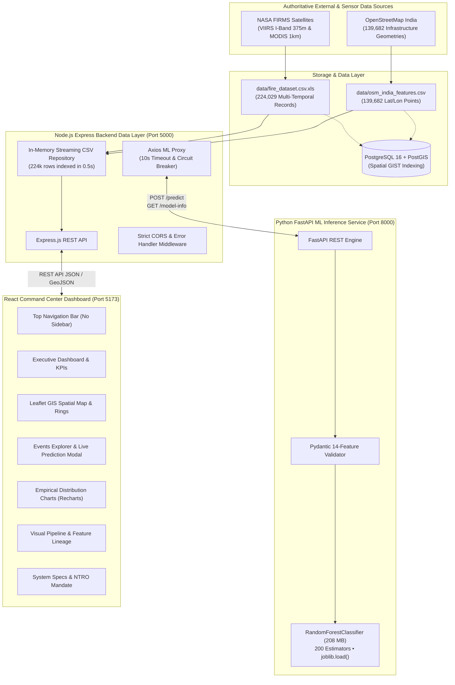

# IndustrialFireAI (SIH Problem Statement 26162)

## AI-Based Detection and Classification of Industrial Fires and Persistent Thermal Sources Using NASA FIRMS, OSM & Satellite Data

**Organization:** National Technical Research Organisation (NTRO)  
**Problem Statement ID:** 26162  
**Phase:** Phase 12 Complete - SIH Demonstration & Evaluation Release  
**Status:** Production-Ready Geospatial Intelligence System

> **SIH 2024 Evaluator Resources:**
> - 📘 **[SIH Demonstration Guide (13-Step Flow)](file:///c:/Users/rajku/Desktop/SIH-PS-2/IndustrialFireAI/docs/SIH_DEMO_GUIDE.md)**
> - 📐 **[System Architecture & Technical Specifications](file:///c:/Users/rajku/Desktop/SIH-PS-2/IndustrialFireAI/docs/SIH_ARCHITECTURE.md)**
> - 🧪 **[Quality Assurance & Verification Test Report](file:///c:/Users/rajku/Desktop/SIH-PS-2/IndustrialFireAI/docs/TEST_REPORT.md)**
> - 📊 **[Authoritative ML Model Card](file:///c:/Users/rajku/Desktop/SIH-PS-2/IndustrialFireAI/docs/ML_MODEL_CARD.md)**

---

## 1. System Architecture Diagram



---

## 2. Technology Stack & Port Allocations

| Component | Technology Stack | Container Port | Host Port | Primary Endpoint / Health URL |
|---|---|---|---|---|
| **Frontend** | React 18, Vite 6, Tailwind CSS 3, Leaflet, Nginx 1.27 Alpine | `80` | `3000` | [http://localhost:3000](http://localhost:3000) |
| **Backend API** | Node.js 20 Alpine, Express 4, Axios, Morgan, Dotenv | `5000` | `5000` | [http://localhost:5000/api/health](http://localhost:5000/api/health) |
| **ML Service** | Python 3.11 Slim, FastAPI, scikit-learn 1.9, joblib, Pydantic | `8000` | `8000` | [http://localhost:8000/health](http://localhost:8000/health) |
| **Database** | PostgreSQL 16 + PostGIS 3.4 (persistent storage volume) | `5432` | `5432` | `localhost:5432` (`industrial_fire_db`) |

---

## 3. Quickstart: Reproducible Docker Deployment (Recommended)

The entire IndustrialFireAI stack can be built and deployed reproducibly across Linux, macOS, and Windows with a single Docker Compose workflow.

### Prerequisites
- [Docker](https://docs.docker.com/get-docker/) & Docker Compose (v2.20+ or Docker Desktop)

### Deployment Steps

```bash
# 1. Clone repository
git clone https://github.com/organization/IndustrialFireAI.git
cd IndustrialFireAI

# 2. Configure environment variables (template provided, no secrets committed)
cp .env.example .env

# 3. Build production images (Frontend Nginx multi-stage, Backend, ML service)
docker compose build

# 4. Launch all 4 services with automatic dependency resolution and health checks
docker compose up -d

# 5. Verify service health status
docker compose ps
```

### Health Verification & Endpoints

| Service | Target URL | Expected Output |
|---|---|---|
| **Frontend Web App** | [http://localhost:3000](http://localhost:3000) | Full SPA React Command Center |
| **Frontend Health** | [http://localhost:3000/health](http://localhost:3000/health) | `OK` |
| **Backend API Health** | [http://localhost:5000/api/health](http://localhost:5000/api/health) | `{"status":"healthy","services":{"mlService":{"status":"ok"}}}` |
| **ML Inference Health** | [http://localhost:8000/health](http://localhost:8000/health) | `{"status":"ok","model_loaded":true}` |
| **Nginx Proxy to API** | [http://localhost:3000/api/health](http://localhost:3000/api/health) | Transparent reverse proxy to Backend API |
| **Live In-Docker Prediction** | `POST http://localhost:5000/api/predict` | Probabilistic classification + 4-evidence breakdown |

### Service Architecture & Dependencies in Docker Compose
- **Startup Validation:** The ML inference service pre-loads and validates `fire_type_model.pkl` on container lifespan startup; if invalid or missing, healthchecks return HTTP 503.
- **Service Dependency Sequencing:** The Node Express `backend` waits for both `db` and `ml-service` to reach healthy status before accepting client traffic.
- **Frontend Nginx Reverse Proxy:** Nginx serves the compiled production SPA on port 80 and reverse-proxies `/api/` requests internally to `backend:5000`, eliminating cross-origin issues.
- **Database Storage & Schema Migrations:** PostGIS volume (`industrial_fire_postgis_data`) is persistent across container restarts. `database/schema.sql` automatically runs on initial volume creation to create spatial tables and GIST indices.

### Teardown
```bash
# Stop containers while preserving database volume
docker compose down

# Stop containers and purge database volume for a clean slate
docker compose down -v
```

### Deploy to Render

The Render Blueprint deploys the API and private ML service in Singapore. The backend image builds and serves the React frontend as well as the API, so the application and `/api` endpoints share one domain. The API image includes the CSV datasets. PostGIS is not provisioned because the current backend reads the CSV repository and does not query the database.

1. Push this repository to GitHub or GitLab and connect that repository to Render.
2. In the Render Dashboard, choose **New > Blueprint**, select the repository, and deploy the root `render.yaml`.
3. Wait for both services to deploy, then open the `industrialfireai` URL. The React app is served at `/` and the API is available under `/api` on that same domain.
4. For live FIRMS ingestion, add `FIRMS_MAP_KEY` to the backend service in Render. For MapTiler tiles, add `VITE_MAPTILER_API_KEY` to the frontend and redeploy it.

The backend API is publicly reachable and currently has no authentication. The private ML service is not internet-facing. Render's private service requires a paid instance; confirm current pricing before deploying.

---

## 4. Manual Local Development Setup (Alternative)

For iterative local code changes without Docker:

### Step 1: Clone Repository & Install Dependencies

```bash
# Clone the repository
git clone https://github.com/organization/IndustrialFireAI.git
cd IndustrialFireAI

# 1. Install Backend Dependencies
cd backend
npm install
cd ..

# 2. Install Frontend Dependencies
cd frontend
npm install
cd ..

# 3. Setup Python ML Service Virtual Environment
cd ml-service
python -m venv venv

# Windows:
.\venv\Scripts\activate
# Linux / macOS:
# source venv/bin/activate

pip install -r requirements.txt
cd ..
```

---

### Step 2: Database Initialization (Optional)

The backend features a **dual-engine data repository**:
- **Automatic CSV Streaming Mode (Default):** Zero database setup required. Loads, parses, and indexes all 224,029 observation rows and 139,682 OSM feature points in ~0.5 seconds directly from `data/`.
- **PostgreSQL / PostGIS Mode (Production):**

```bash
# Launch PostgreSQL with PostGIS container
docker compose up -d db
```
*The database executes `database/schema.sql` automatically, creating spatial GIST indexes and spatial tables.*

---

### Step 3: Start the Python ML Service

```bash
cd ml-service
# Activate venv if not active
.\venv\Scripts\activate       # Windows
# source venv/bin/activate    # Linux/macOS

uvicorn app.main:app --host 0.0.0.0 --port 8000
```
*Health verification:* [http://localhost:8000/health](http://localhost:8000/health)

---

### Step 4: Start the Node.js Express Backend

In a second terminal:

```bash
cd backend
npm run dev
# or: npm start
```
*Health verification:* [http://localhost:5000/api/health](http://localhost:5000/api/health)

---

### Step 5: Start the React Frontend

In a third terminal:

```bash
cd frontend
npm run dev
```
*Access Application:* [http://localhost:5173](http://localhost:5173)

---

## 5. Evaluator Demo Instructions (Demo Mode)

The application includes an **Evaluator Demo Mode** in the Events Explorer ([http://localhost:3000/events](http://localhost:3000/events)) with 1-click presets based directly on the authoritative dataset:

1. Navigate to **Events** via the Top Navigation Bar.
2. In the **Demo Mode: Evaluator Dataset Presets** banner, click any preset:
   - **🔥 Industrial Fire Preset:** Filters to confirmed industrial fire events with $\ge 5$ days persistence and $\ge 70\%$ confidence.
   - **⚡ Persistent Source Preset:** Filters to stationary high-temperature sources (brick kilns, smelters) with $\ge 15$ days persistence.
   - **🌿 Natural Fire Preset:** Filters to short-duration vegetation/stubble fires with $\ge 85\%$ confidence.
3. Click on any event row to open the **Live ML Inspector Modal**.
4. The system executes a live HTTP request to `POST /api/predict`, feeding the 14 authentic parameters to the Random Forest model on port 8000, returning the real-time probability breakdown (e.g. 96% Industrial Fire, 3% Persistent Source).

> **Observational Integrity Notice:** All demo presets and event records originate from authoritative observations in `data/fire_dataset.csv.xls`. Never call synthetic or demo data real satellite observations.

---

## 6. API Reference & Contract Documentation

### 1. `GET /api/health`
Returns the status of the backend and verifies connectivity to the Python ML inference service.
```json
{
  "status": "healthy",
  "service": "industrial-fire-backend",
  "uptimeSeconds": 312,
  "environment": "production",
  "services": {
    "mlService": {
      "reachable": true,
      "status": "ok",
      "details": {
        "model_loaded": true,
        "model_type": "RandomForestClassifier",
        "feature_count": 14
      }
    },
    "dataLayer": {
      "mode": "csv_repository",
      "eventsCount": 224061,
      "infrastructureCount": 139682
    }
  }
}
```

### 2. `GET /api/events`
Returns paginated thermal events with optional query filters.
- **Query Parameters:**
  - `classification`: Filter by `'Industrial Fire'`, `'Persistent Thermal Source'`, `'Natural Fire'`, `'Other'`.
  - `minConfidence`, `maxConfidence`: Float range (0.0 to 1.0).
  - `minPersistence`, `maxPersistence`: Integer range in days.
  - `search` / `q`: Event ID search.
  - `page`: Page index (default: `1`).
  - `limit`: Page size (default: `50`).

### 3. `GET /api/events/:id`
Returns full 14-feature attributes and multi-criteria spatial context for a single verified event ID.

### 4. `GET /api/events/stats`
Computes empirical aggregations across all records:
- Classification counts and percentages
- Confidence band counts (HIGH, MEDIUM, LOW)
- Persistence distribution histogram bins (1-5d, 6-15d, 16-30d, 31-60d, 60+d)
- Fire Radiative Power (FRP) histogram bins (0-5, 5-15, 15-30, 30-50, 50+ MW)
- Detection scan distribution bins (1-5, 6-20, 21-50, 51-100, 100+ scans)
- Cross-class empirical signature comparison (`classComparison`)
- High-confidence target counts (`highConfidenceStats`: 5,477 targets)

### 5. `GET /api/events/geojson`
Returns a valid GeoJSON `FeatureCollection` with data integrity metadata explaining that native coordinates for raw observations are preserved without synthetic coordinate fabrication.

### 6. `GET /api/infrastructure`
Returns paginated OpenStreetMap infrastructure points across India.
- **Query Parameters:**
  - `category`: Filter by `'industrial'`, `'power_plant'`, `'quarry'`, `'substation'`, `'storage_tank'`, `'works'`.
  - `format=geojson`: Returns standard GeoJSON `FeatureCollection` with Point geometries.
  - `limit`, `page`: Pagination controls.

### 7. `GET /api/model-info`
Proxies model metadata from the Python ML service.
```json
{
  "model_type": "RandomForestClassifier",
  "version": "2.0.0",
  "classes": ["Industrial Fire", "Natural Fire", "Other", "Persistent Thermal Source"],
  "feature_count": 14,
  "n_estimators": 150
}
```

### 8. `POST /api/predict`
Proxies live 14-feature classification requests to the ML service and returns probabilistic class scores plus multi-factor transparent evidence.

---

## 7. Environment Variables Configuration (`.env.example`)

A clean template is provided in `.env.example` with zero hard-coded secrets or credentials:

```bash
cp .env.example .env
```

| Variable | Default Value | Description |
|---|---|---|
| `FRONTEND_PORT` | `3000` | Host port for Nginx web frontend |
| `BACKEND_PORT` | `5000` | Host port for Node.js Express API |
| `ML_PORT` | `8000` | Host port for Python FastAPI ML inference service |
| `POSTGRES_PORT` | `5432` | Host port for PostGIS database |
| `POSTGRES_DB` | `industrial_fire_db` | PostgreSQL database name |
| `POSTGRES_USER` | `postgres` | Database admin user |
| `POSTGRES_PASSWORD` | `postgrespassword` | Database admin password (override for production) |
| `DATABASE_URL` | `postgresql://...` | Connection URI for backend to connect to database |
| `ML_SERVICE_URL` | `http://ml-service:8000` | Microservice URL for backend to ML communications |
| `CORS_ORIGIN` | `http://localhost:3000,...` | Allowed CORS origins for browser security |
| `FIRMS_MAP_KEY` | *(empty string)* | NASA FIRMS Map Key for live satellite ingestion |
| `MODEL_PATH` | `/app/model/fire_type_model.pkl`| Path to authoritative Scikit-Learn model binary |
| `VITE_API_URL` | `/api` | Base path for frontend API calls (proxied by Nginx) |

---

## 8. Verification & Test Suite Results

The project has been rigorously tested across all tiers (see [docs/TEST_REPORT.md](file:///c:/Users/rajku/Desktop/SIH-PS-2/IndustrialFireAI/docs/TEST_REPORT.md)):

- **Backend API & Ingestion Tests:** `52 / 52 passed` (`npm test` in `backend/`).
- **Python ML Inference & Pipeline Tests:** `15 / 15 passed` (`pytest` in `ml-service/`).
- **Frontend SPA Components & UI Tests:** `23 / 23 passed` (`npm test` in `frontend/`).
- **Production Build:** Vite bundle generated with `0 errors`.
- **Docker Compose Orchestration:** All 4 services (`db`, `ml-service`, `backend`, `frontend`) build, start, communicate, and pass automated container health checks.

---

## 9. Known Limitations & Scientific Disclaimers

1. **Probabilistic Classification:** Thermal anomaly classification is probabilistic and derived from VIIRS/MODIS radiometric measurements and OpenStreetMap spatial correlation. Satellite data alone cannot establish definitive on-the-ground physical root cause without field inspection.
2. **Dual Data Repository:** The backend features both an instant streaming CSV repository for offline evaluation and a PostGIS persistent database for live GIS ingestion.
3. **NASA FIRMS Rate Limits:** Free NASA FIRMS map keys have daily download quotas; the ingestion pipeline safely throttles requests and deduplicates all ingested records.
