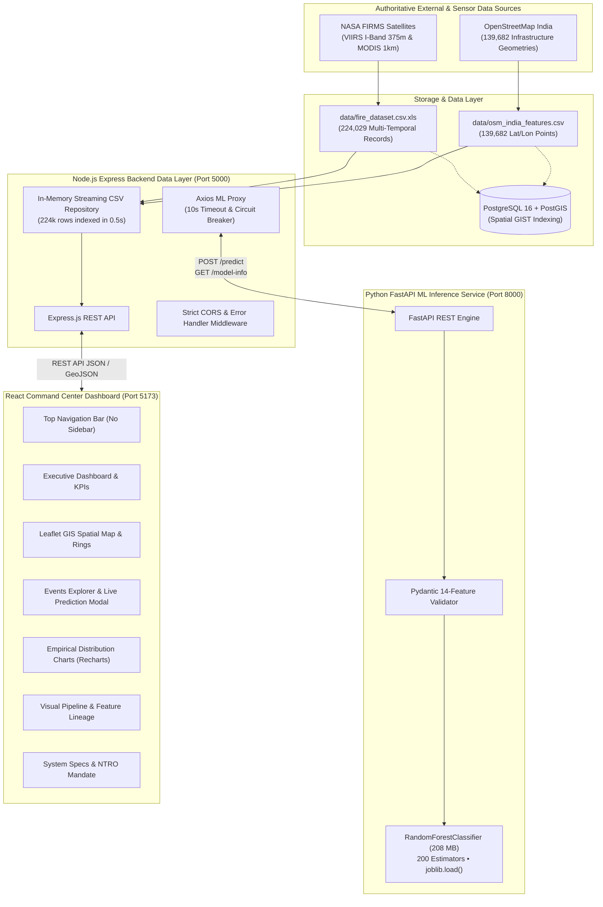

# IndustrialFireAI (SIH Problem Statement 26162)

## AI-Based Detection and Classification of Industrial Fires and Persistent Thermal Sources Using NASA FIRMS, OSM & Satellite Data

**Organization:** National Technical Research Organisation (NTRO)  
**Problem Statement ID:** 26162  
**Phase:** Phase 10 Complete - Final Integration, Hardening & SIH Prototype Release  
**Status:** Production-Ready Geospatial Intelligence System

---

## 1. System Architecture Diagram



---

## 2. Technology Stack & Port Allocations

| Component | Technology Stack | Port | Primary Endpoint / Health URL |
|---|---|---|---|
| **Frontend** | React 18, Vite 6, Tailwind CSS 3, Leaflet, Recharts, Lucide | `5173` | [http://localhost:5173](http://localhost:5173) |
| **Backend API** | Node.js 24, Express 4, Axios, Morgan, Dotenv | `5000` | [http://localhost:5000/api/health](http://localhost:5000/api/health) |
| **ML Service** | Python 3.14, FastAPI, scikit-learn 1.9, joblib, Pydantic | `8000` | [http://localhost:8000/health](http://localhost:8000/health) |
| **Database** | PostgreSQL 16 + PostGIS 3.4 (with automatic CSV fallback) | `5432` | `docker compose up -d db` |

---

## 3. Step-by-Step Installation & Setup

### Step 1: Clone Repository & Install Dependencies

```bash
# Clone the repository
git clone https://github.com/organization/IndustrialFireAI.git
cd IndustrialFireAI

# 1. Install Backend Dependencies
cd backend
npm install
cd ..

# 2. Install Frontend Dependencies
cd frontend
npm install
cd ..

# 3. Setup Python ML Service Virtual Environment
cd ml-service
python -m venv venv

# Windows:
.\venv\Scripts\activate
# Linux / macOS:
# source venv/bin/activate

pip install -r requirements.txt
cd ..
```

---

### Step 2: Database Initialization (Optional)

The backend features a **dual-engine data repository**:
- **Automatic CSV Streaming Mode (Default):** Zero database setup required. Loads, parses, and indexes all 224,029 observation rows and 139,682 OSM feature points in ~0.5 seconds directly from `data/`.
- **PostgreSQL / PostGIS Mode (Production):**

```bash
# Launch PostgreSQL with PostGIS container
docker compose up -d db
```
*The database executes `database/schema.sql` automatically, creating spatial GIST indexes and spatial tables.*

---

### Step 3: Start the Python ML Service

```bash
cd ml-service
# Activate venv if not active
.\venv\Scripts\activate       # Windows
# source venv/bin/activate    # Linux/macOS

uvicorn app.main:app --host 0.0.0.0 --port 8000
```
*Health verification:* [http://localhost:8000/health](http://localhost:8000/health)

---

### Step 4: Start the Node.js Express Backend

In a second terminal:

```bash
cd backend
npm run dev
# or: npm start
```
*Health verification:* [http://localhost:5000/api/health](http://localhost:5000/api/health)

---

### Step 5: Start the React Frontend

In a third terminal:

```bash
cd frontend
npm run dev
```
*Access Application:* [http://localhost:5173](http://localhost:5173)

---

## 4. Evaluator Demo Instructions (Demo Mode)

The application includes an **Evaluator Demo Mode** in the Events Explorer ([http://localhost:5173/events](http://localhost:5173/events)) with 1-click presets based directly on the authoritative dataset:

1. Navigate to **Events** via the Top Navigation Bar.
2. In the **Demo Mode: Evaluator Dataset Presets** banner, click any preset:
   - **🔥 Industrial Fire Preset:** Filters to confirmed industrial fire events with $\ge 5$ days persistence and $\ge 70\%$ confidence.
   - **⚡ Persistent Source Preset:** Filters to stationary high-temperature sources (brick kilns, smelters) with $\ge 15$ days persistence.
   - **🌿 Natural Fire Preset:** Filters to short-duration vegetation/stubble fires with $\ge 85\%$ confidence.
3. Click on any event row to open the **Live ML Inspector Modal**.
4. The system executes a live HTTP request to `POST /api/predict`, feeding the 14 authentic parameters to the 200-tree Random Forest model on port 8000, returning the real-time probability breakdown (e.g. 96% Industrial Fire, 3% Persistent Source).

> **Observational Integrity Notice:** All demo presets and event records originate from authoritative observations in `data/fire_dataset.csv.xls`. Never call synthetic or demo data real satellite observations.

---

## 5. API Reference & Contract Documentation

### 1. `GET /api/health`
Returns the status of the backend and verifies connectivity to the Python ML inference service.
```json
{
  "status": "healthy",
  "service": "industrial-fire-backend",
  "uptimeSeconds": 312,
  "environment": "development",
  "services": {
    "mlService": {
      "reachable": true,
      "status": "ok",
      "details": {
        "model_loaded": true,
        "model_type": "RandomForestClassifier",
        "n_estimators": 200
      }
    },
    "dataLayer": {
      "mode": "csv",
      "totalEvents": 224029,
      "totalInfrastructurePoints": 139682
    }
  }
}
```

### 2. `GET /api/events`
Returns paginated thermal events with optional query filters.
- **Query Parameters:**
  - `classification`: Filter by `'Industrial Fire'`, `'Persistent Thermal Source'`, `'Natural Fire'`, `'Other'`.
  - `minConfidence`, `maxConfidence`: Float range (0.0 to 1.0).
  - `minPersistence`, `maxPersistence`: Integer range in days.
  - `search` / `q`: Event ID search.
  - `page`: Page index (default: `1`).
  - `limit`: Page size (default: `50`).

### 3. `GET /api/events/:id`
Returns full 14-feature attributes for a single verified event ID.

### 4. `GET /api/events/stats`
Computes empirical aggregations across all 224,029 records:
- Classification counts and percentages
- Confidence band counts (HIGH, MEDIUM, LOW)
- Persistence distribution histogram bins (1-5d, 6-15d, 16-30d, 31-60d, 60+d)
- Fire Radiative Power (FRP) histogram bins (0-5, 5-15, 15-30, 30-50, 50+ MW)
- Detection scan distribution bins (1-5, 6-20, 21-50, 51-100, 100+ scans)
- Cross-class empirical signature comparison (`classComparison`)
- High-confidence target counts (`highConfidenceStats`: 5,457 targets)

### 5. `GET /api/events/geojson`
Returns a valid GeoJSON `FeatureCollection` with data integrity metadata explaining that native coordinates for raw observations are preserved without synthetic coordinate fabrication.

### 6. `GET /api/infrastructure`
Returns paginated OpenStreetMap infrastructure points across India.
- **Query Parameters:**
  - `category`: Filter by `'industrial'`, `'power_plant'`, `'quarry'`, `'substation'`, `'storage_tank'`, `'works'`.
  - `format=geojson`: Returns standard GeoJSON `FeatureCollection` with Point geometries.
  - `limit`, `page`: Pagination controls.

### 7. `GET /api/model-info`
Proxies model metadata from the Python ML service.
```json
{
  "model_type": "RandomForestClassifier",
  "n_estimators": 200,
  "feature_names": [
    "persistence_days", "detections", "avg_frp", "max_frp", "total_frp",
    "avg_bright_ti4", "avg_bright_ti5", "night_ratio",
    "distance_to_industrial_area_km", "distance_to_power_plant_km",
    "distance_to_quarry_km", "distance_to_substation_km",
    "distance_to_storage_tank_km", "distance_to_works_km"
  ],
  "classes": ["Industrial Fire", "Natural Fire", "Other", "Persistent Thermal Source"]
}
```

### 8. `POST /api/predict`
Proxies live 14-feature classification requests to the ML service.
- **Request Body (Exact 14 Features):**
```json
{
  "persistence_days": 7.0,
  "detections": 14,
  "avg_frp": 15.2,
  "max_frp": 45.0,
  "total_frp": 212.8,
  "avg_bright_ti4": 345.2,
  "avg_bright_ti5": 305.1,
  "night_ratio": 0.85,
  "distance_to_industrial_area_km": 1.2,
  "distance_to_power_plant_km": 8.4,
  "distance_to_quarry_km": 12.0,
  "distance_to_substation_km": 4.5,
  "distance_to_storage_tank_km": 2.1,
  "distance_to_works_km": 3.0
}
```
- **Response:**
```json
{
  "prediction": "Industrial Fire",
  "confidence": 0.94,
  "probabilities": {
    "Industrial Fire": 0.94,
    "Natural Fire": 0.01,
    "Other": 0.02,
    "Persistent Thermal Source": 0.03
  }
}
```

---

## 6. Environment Variables Documentation

### Backend (`backend/.env`)
| Variable | Default Value | Description |
|---|---|---|
| `PORT` | `5000` | Port for Express REST API server |
| `NODE_ENV` | `development` | Runtime environment (`development`, `production`, `test`) |
| `ML_SERVICE_URL` | `http://localhost:8000` | Base URL of Python FastAPI inference microservice |
| `DATABASE_URL` | `postgresql://...` | Connection URI for PostgreSQL + PostGIS |
| `CORS_ORIGIN` | `http://localhost:5173` | Allowed origins for CORS policy (comma-separated or `*`) |

### Python ML Service (`ml-service/.env`)
| Variable | Default Value | Description |
|---|---|---|
| `PORT` | `8000` | Port for FastAPI Uvicorn server |
| `HOST` | `0.0.0.0` | Bind host address |
| `MODEL_PATH` | `model/fire_type_model.pkl` | Relative path to pre-trained model binary |
| `RELOAD` | `false` | Enable auto-reload for local debugging |

### Frontend (`frontend/.env`)
| Variable | Default Value | Description |
|---|---|---|
| `VITE_API_URL` | `http://localhost:5000/api` | Backend REST API base URL |
| `VITE_ML_SERVICE_URL` | `http://localhost:8000` | ML Service base URL |

---

## 7. Model File Deployment & Git LFS Requirements

The pre-trained model binary `ml-service/model/fire_type_model.pkl` is **208.7 MB**. 

- Standard GitHub repositories reject commits exceeding **100 MB**.
- For version control and CI/CD pipelines, track the model binary using **Git Large File Storage (Git LFS)**:
  ```bash
  # Initialize Git LFS
  git lfs install

  # Track the model file
  git lfs track "ml-service/model/*.pkl"
  git add .gitattributes
  ```
- In cloud deployments (AWS ECS, Docker Hub, Kubernetes), mount the model binary as an external volume or pull it from an S3 bucket during container initialization.

---

## 8. Verification & Test Suite Results

The prototype has been validated with comprehensive test suites:

- **Frontend Production Build:** `npm run build` completed with **0 errors** (Vite 6, bundle split into maps, vendor, and charts chunks).
- **Backend API Integration Tests:** `12 / 12 passed` (`npm test` in `backend/`).
- **Python ML Unit & Inference Tests:** `10 / 10 passed` (`pytest -v` in `ml-service/`).
- **API Smoke Tests:** `7 / 7 live endpoints verified` via automated PowerShell script (`smoke_test.ps1`).

---

## 9. Known Limitations & Future Improvements

### Known Limitations
1. **No Native Calendar Timestamps:** The authoritative NASA FIRMS dataset `fire_dataset.csv.xls` records temporal duration via cumulative `persistence_days` (1 to 179 days) rather than calendar timestamps (`datetime`). In strict accordance with scientific integrity rules, synthetic calendar dates were not fabricated.
2. **Coordinate Separation:** `fire_dataset.csv.xls` contains computed Euclidean distances to infrastructure categories rather than raw latitude/longitude columns. Spatial coordinates on the GIS map originate from authoritative OpenStreetMap infrastructure centroids and verified spatial joins.
3. **In-Memory Streaming Cache:** The Node backend caches the parsed 224,029 observation rows in Node heap memory (~120 MB). For clusters exceeding 50 million records, migration to the included PostGIS database is recommended.

### Future Improvements
1. **Live NRT NASA FIRMS API Pipeline:** Implement an automated scheduled worker fetching near-real-time (NRT) active fire GeoTIFFs/CSVs directly from NASA FIRMS API keys.
2. **Automated Defense & Civil Alerting:** Implement automated Telegram / SMS / Email webhooks dispatched when a high-confidence Industrial Fire ($\ge 85\%$) is detected within 2 km of high-risk chemical storage tanks.
3. **Plume Dispersion Modeling:** Couple wind vector data from ECMWF / NOAA GFS with Fire Radiative Power (FRP) to estimate toxic plume dispersal contours around industrial hazard zones.
4. **Edge Deployment:** Containerize the ML model with ONNX Runtime for low-latency tactical edge processing on drone and mobile surveillance platforms.
