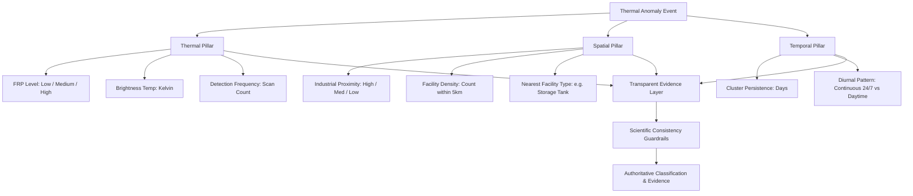

# Multi-Source Classification & Evidence Reasoning Layer (Phase 7)

**Document Version:** 1.0.0  
**Problem Statement ID:** 26162  
**Organization:** National Technical Research Organisation (NTRO)  
**System Title:** AI-Based Detection and Classification of Industrial Fires and Persistent Thermal Sources Using NASA FIRMS, OSM & Satellite Data  

---

## 1. Objectives & Guiding Principles

The objective of Phase 7 is to make thermal anomaly classification **transparent, auditable, and scientifically defensible**. In remote sensing, satellite pixels capture heat anomalies; machine learning alone cannot determine the physical root cause of a fire (such as deliberate industrial flare vs. accidental blaze vs. agricultural burning) without corroborating evidence across multiple sensor and geospatial streams.

### Scientific Ground Rules:
1. **Never Claim Exact Physical Root Cause Without Physical Context:**  
   Classification outputs are probabilistic hypotheses based on radiometry and spatial correlation, not ground-truth physical causation proofs.
2. **Never Fabricate Probabilities:**  
   Confidence scores correspond strictly to the regularized RandomForestClassifier model's calibrated class posterior probabilities $P(\text{class} \mid X)$ or authentic sensor telemetry.
3. **Multi-Source Evidence Synthesis:**  
   Every classification decision is justified by explicit, human-interpretable factors across three distinct physical dimensions:
   - **Thermal:** FRP, brightness temperature, detection frequency
   - **Spatial:** distance to nearest industrial facility, cluster infrastructure density, industrial land context
   - **Temporal:** cluster persistence (days), diurnal pattern (night ratio / 24/7 continuous operation)
4. **Automated Scientific Consistency Guardrails:**  
   Hard physical constraints prevent unrealistic claims (e.g. an anomaly located 50 km from any known industrial infrastructure cannot be classified as an `Industrial Fire`, regardless of nominal FRP).

---

## 2. Multi-Dimensional Evidence Dimensions & Thresholds



### 2.1 Thermal Dimension
- **Fire Radiative Power (FRP):**
  - `< 10 MW`: `low` — Small surface fire, smoldering biomass, or minor thermal patch.
  - `10 - 50 MW`: `medium` — Typical active flame front or routine stack flaring.
  - `> 50 MW`: `high` — High-intensity thermal release, heavy petrochemical flaring, or major furnace exhaust.
- **Brightness Temperature ($T_{I4}$ @ 3.75 µm):**
  - `< 325 K`: `low` — Near-ambient background temperature.
  - `325 - 355 K`: `medium` — Warm surface heat.
  - `> 355 K`: `high` — Intense thermal emission characteristic of active combustion.
- **Detection Frequency:**
  - `< 4 detections`: `low`
  - `4 - 15 detections`: `medium`
  - `> 15 detections`: `high` — Highly recurring observation across multiple sensor overpasses.

### 2.2 Spatial Dimension
- **Industrial Proximity (Geodesic Distance to Nearest OSM Asset):**
  - `≤ 1.5 km`: `high` — Direct facility proximity or co-location within industrial estate.
  - `1.5 - 4.0 km`: `medium` — Industrial corridor or buffer zone.
  - `4.0 - 10.0 km`: `low` — Regional proximity.
  - `> 10.0 km`: `negligible` — Remote rural / forest / wildland setting.
- **Infrastructure Density:**
  - Count of gazetted industrial facilities within a 5 km geodesic radius:
  - `≥ 4 facilities`: `high`
  - `1 - 3 facilities`: `medium`
  - `0 facilities`: `low` / `negligible`
- **Infrastructure Context:**
  - Categorical facility classification derived from OSM: `storage_tank`, `power_plant`, `industrial_area`, `works`, `quarry`, `substation`.

### 2.3 Temporal Dimension
- **Cluster Persistence:**
  - `1 - 2 days`: `low` — Transient event, typical of open agricultural burning.
  - `3 - 9 days`: `medium` — Multi-day sustained combustion.
  - `≥ 10 days`: `high` — Chronic thermal emission, primary signature of stationary industrial operations (flares, smelters).
- **Diurnal Operational Pattern (Night Ratio):**
  - `Night Ratio ≥ 0.60`: `CONTINUOUS_24_7` — Strong indication of 24-hour industrial operations.
  - `0.25 ≤ Night Ratio < 0.60`: `MIXED_DIURNAL` — Extended burning across afternoon and evening overpasses.
  - `Night Ratio < 0.25`: `DAYTIME_DOMINATED` — Strongly daytime-peaking, characteristic of wildland and crop stubble fires driven by solar warming and wind.

---

## 3. Scientific Consistency Guardrails

To prevent the AI from generating scientifically indefensible hypotheses, rule-based physical guardrails run over raw ML predictions:

1. **Remote Industrial Fire Guardrail:**  
   If the ML model predicts `Industrial Fire` but the minimum distance to any industrial infrastructure exceeds **10.0 km**, the classification is re-assigned to `Natural Fire` (if FRP $\ge$ 15 MW) or `Other`, with a transparent explanation attached:  
   *`"Remote distance (X.X km) contradicts Industrial Fire hypothesis. Reclassified to Natural Fire."`*
2. **Transient Persistent Source Guardrail:**  
   If the ML model predicts `Persistent Thermal Source` but the event has a persistence of $\le 1$ day and a daytime-only signature, it is re-assigned to `Natural Fire` or `Other`.
3. **Mandatory Disclaimer:**  
   Every prediction and event payload explicitly carries the scientific disclaimer:  
   *`"Thermal anomaly classification is probabilistic and derived from VIIRS/MODIS radiometric measurements and OpenStreetMap spatial correlation. Satellite data alone cannot establish definitive on-the-ground physical root cause without field inspection."`*

---

## 4. API Specification & Example Payloads

### Request: `POST /api/predict`
```json
{
  "persistence_days": 6.0,
  "detections": 22,
  "avg_frp": 65.5,
  "max_frp": 98.0,
  "total_frp": 1441.0,
  "avg_bright_ti4": 368.5,
  "avg_bright_ti5": 305.2,
  "night_ratio": 0.75,
  "distance_to_industrial_area_km": 0.8,
  "distance_to_power_plant_km": 12.0,
  "distance_to_quarry_km": 15.0,
  "distance_to_substation_km": 2.1,
  "distance_to_storage_tank_km": 0.45,
  "distance_to_works_km": 3.2
}
```

### Response: `200 OK`
```json
{
  "prediction": "Industrial Fire",
  "confidence": 0.91,
  "probabilities": {
    "Industrial Fire": 0.91,
    "Persistent Thermal Source": 0.06,
    "Natural Fire": 0.02,
    "Other": 0.01
  },
  "evidence": {
    "classification": "Industrial Fire",
    "confidence": 0.91,
    "probabilities": {
      "Industrial Fire": 0.91,
      "Persistent Thermal Source": 0.06,
      "Natural Fire": 0.02,
      "Other": 0.01
    },
    "factors": [
      {
        "factor": "industrial proximity",
        "level": "high",
        "detail": "0.45 km to nearest storage tank"
      },
      {
        "factor": "persistence",
        "level": "medium",
        "detail": "6.0 days cluster duration"
      },
      {
        "factor": "FRP",
        "level": "high",
        "detail": "65.5 MW average radiative power"
      },
      {
        "factor": "infrastructure density",
        "level": "high",
        "detail": "4 industrial facilities within radius"
      }
    ],
    "summary_text": [
      "industrial proximity: high",
      "persistence: medium",
      "FRP: high",
      "infrastructure density: high"
    ],
    "thermal": {
      "frp_level": "high",
      "frp_mw": 65.5,
      "temperature_level": "high",
      "brightness_kelvin": 368.5,
      "detection_frequency_level": "high",
      "detections": 22
    },
    "spatial": {
      "proximity_level": "high",
      "min_distance_km": 0.45,
      "nearest_category": "storage tank",
      "density_level": "high",
      "nearby_count": 4
    },
    "temporal": {
      "persistence_level": "medium",
      "persistence_days": 6.0,
      "diurnal_pattern": "CONTINUOUS_24_7",
      "night_ratio": 0.75
    },
    "guardrail_note": null,
    "scientific_disclaimer": "Thermal anomaly classification is probabilistic and derived from VIIRS/MODIS radiometric measurements and OpenStreetMap spatial correlation. Satellite data alone cannot establish definitive on-the-ground physical root cause without field inspection."
  }
}
```

---

## 5. UI Integration in GIS & Explorer

1. **Leaflet Map Popups (`MapView.jsx`):**  
   Hotspot popups feature an **Evidence Factors** badge grid showing the 4 primary factors (`industrial proximity`, `persistence`, `FRP`, `infrastructure density`) with intuitive color-coded levels.
2. **Surveillance Inspector Drawer (`MapView.jsx`):**  
   Selected hotspot cards display the complete multi-source breakdown, nearest infrastructure context, calibrated model confidence, and the scientific disclaimer.
3. **Observation Explorer Detail Modal (`Events.jsx`):**  
   Clicking any event in the explorer table queries live inference and renders the comprehensive **Multi-Source Classification Evidence Card**, showing model probability bars, 3-pillar breakdown (Thermal, Spatial, Temporal), guardrail alerts, and disclaimer.

---

## 6. Verification & Test Suite Summary

- **ML Service Unit Tests:** [`ml-service/tests/test_api.py`](file:///c:/Users/rajku/Desktop/SIH-PS-2/IndustrialFireAI/ml-service/tests/test_api.py)  
  *Result: 11 Passed, 0 Failed (100% pass rate)*  
  Includes dedicated tests for factor formatting, thermal/spatial/temporal ratings, and the remote wilderness guardrail.
- **Backend Evidence Tests:** [`backend/tests/classification_evidence.test.js`](file:///c:/Users/rajku/Desktop/SIH-PS-2/IndustrialFireAI/backend/tests/classification_evidence.test.js)  
  *Result: 6 Passed, 0 Failed (100% pass rate)*  
  Tests multi-source synthesis, guardrails against over-claiming, probability preservation, and event serialization.
- **Backend Full Test Suite:** [`backend/package.json`](file:///c:/Users/rajku/Desktop/SIH-PS-2/IndustrialFireAI/backend/package.json)  
  *Result: 46 Passed across 5 suites (100% pass rate)*
- **Frontend GIS & Evidence Tests:** [`frontend/tests/gis_map.test.js`](file:///c:/Users/rajku/Desktop/SIH-PS-2/IndustrialFireAI/frontend/tests/gis_map.test.js)  
  *Result: 12 Passed, 0 Failed (100% pass rate)*
