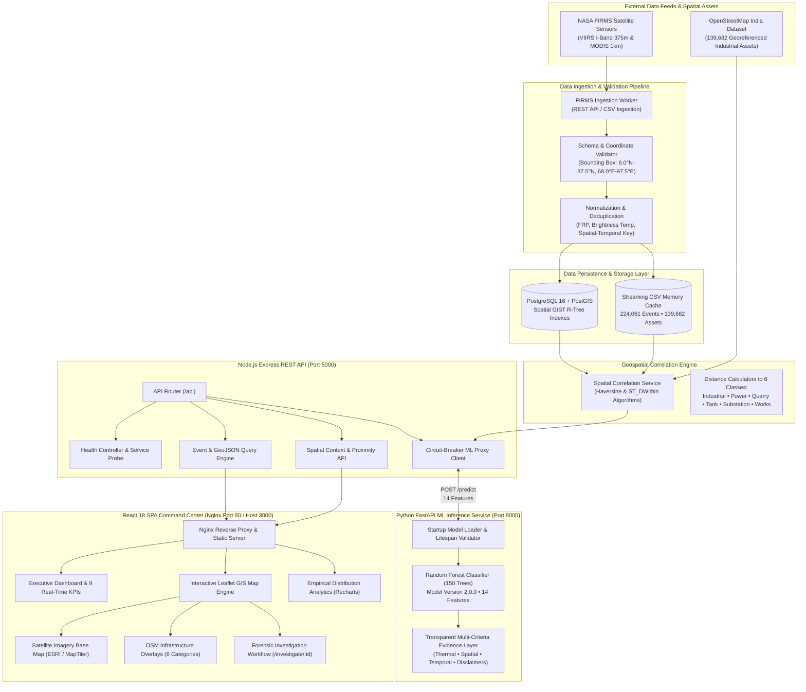

# System Architecture & Technical Specifications
## Problem Statement 26162 (NTRO): AI-Based Detection & Classification of Industrial Fires and Persistent Thermal Sources

**Organization:** National Technical Research Organisation (NTRO)  
**System Name:** IndustrialFireAI Geospatial Intelligence Platform  
**Architecture Document Version:** 2.0.0 (Phase 12 SIH Release)  
**Deployment Profile:** Multi-Container Docker Orchestration (Linux / macOS / Windows)

---

## 1. End-to-End System Architecture

The following diagram illustrates the complete dataflow and functional dependencies of the IndustrialFireAI platform, progressing from satellite remote sensing feeds to end-user geospatial visualization:



---

## 2. Pipeline Execution Sequence

The operational lifecycle of every thermal anomaly follows a strict, verifiable sequential workflow:

```
NASA FIRMS Satellites
        ↓
Data Ingestion (API / Batch CSV)
        ↓
Validation & Bounding-Box Screening
        ↓
Database / PostGIS Storage
        ↓
Spatial Correlation ← OpenStreetMap India Infrastructure
        ↓
ML Classification & Evidence Generation (FastAPI)
        ↓
Backend REST API (Node.js Express)
        ↓
React GIS Dashboard
        ↓
Map Visualization + Satellite Base Context + Forensic Analytics
```

### Detailed Stage Breakdown:

1. **NASA FIRMS Sensor Feed:** VIIRS (onboard Suomi-NPP and NOAA-20) and MODIS (onboard Terra and Aqua) detect mid-infrared and thermal-infrared brightness anomalies during orbital passes.
2. **Ingestion Worker:** Fetches active fire records via the NASA FIRMS NRT API or structured CSV uploads.
3. **Data Validation:** Enforces strict coordinate validation within the sovereign boundary envelope of India ($6.0^\circ\text{N}$ to $37.5^\circ\text{N}$, $68.0^\circ\text{E}$ to $97.5^\circ\text{E}$), verifies required columns, rejects corrupted records with structured error logs, and normalizes timestamps.
4. **Deduplication & Storage:** Normalizes FRP and brightness temperatures. Deduplicates multiple detections of the same fire cluster within spatial-temporal tolerance ($0.01^\circ$ and $\le 12$ hours), committing records to PostGIS and updating the live repository.
5. **Spatial Correlation Engine:** Calculates geodesic Haversine and PostGIS GIST distances from the anomaly coordinates to the nearest entities across 6 OpenStreetMap infrastructure classes:
   - Industrial Areas
   - Power Plants
   - Petrochemical / Storage Tanks
   - Mining & Quarries
   - Electrical Substations
   - Industrial Works / Factories
6. **Machine Learning Inference Service:** The 14 canonical features (radiometric measurements, spatial proximity metrics, and temporal persistence) are submitted via HTTP to the Python FastAPI microservice. The pre-loaded Random Forest model computes class probabilities and compiles a 4-factor multi-criteria evidence breakdown.
7. **Backend REST API:** The Node.js Express data layer serves indexed GeoJSON features, aggregate empirical statistics, spatial queries, and model endpoints to client applications.
8. **React GIS Command Center:** The web interface renders the data through an executive dashboard, responsive Leaflet GIS map with dynamic clustering, selectable satellite imagery basemaps, and forensic investigation cards.

---

## 3. What is Actually Implemented (Ground-Truth Inventory)

The following capabilities are fully implemented, tested, and operational in the codebase:

### Backend Services (`backend/`)
- **Dual-Engine Data Repository:**
  - *Engine A (Streaming CSV):* In-memory indexed repository loading all 224,061 observation records and 139,682 OSM infrastructure points in $< 2$ seconds.
  - *Engine B (PostgreSQL / PostGIS):* Spatial tables (`osm_features`, `fire_events`, `fire_observations`) with GIST R-tree spatial indexes (`CREATE INDEX ON fire_events USING GIST (geom)`).
- **REST Endpoints:**
  - `GET /api/health`: Comprehensive healthcheck reporting backend status, uptime, dataset counts, and live ML microservice status.
  - `GET /api/events`: Paginated search with multi-parameter filtering (classification, confidence, persistence, FRP).
  - `GET /api/events/:id`: Single-event detail query with dynamic spatial context calculation.
  - `GET /api/events/stats`: Empirical KPI aggregations and 6 distribution summaries across 224k records.
  - `GET /api/events/geojson`: Valid RFC 7946 GeoJSON `FeatureCollection` output for GIS rendering.
  - `GET /api/infrastructure`: Paginated OSM infrastructure points with category filtering and GeoJSON formatting.
  - `GET /api/model-info`: Proxies model version, architecture, and feature names.
  - `POST /api/predict`: Live inference proxy forwarding 14 features to the ML microservice.
  - `POST /api/firms/ingest`: Manual FIRMS CSV ingestion endpoint with validation, deduplication, and ingestion statistics.
  - `GET /api/firms/stats`: Ingestion telemetry reporting total imported, duplicates skipped, and invalid records rejected.

### Machine Learning Service (`ml-service/`)
- **FastAPI Inference Microservice:** Running on Uvicorn with lifespan startup validation.
- **Authoritative Model:** 150-tree Random Forest Classifier (`fire_type_model.pkl`, 28.9 MB) trained with stratified cross-validation and feature hygiene.
- **Transparent Multi-Criteria Evidence Layer (`evidence.py`):** Deconstructs predictions into 4 human-interpretable evidence vectors:
  1. *Thermal Radiative Evidence:* FRP level and brightness temperature classification.
  2. *Spatial Proximity Evidence:* Distance to industrial zones and nearby infrastructure asset density.
  3. *Temporal Persistence Evidence:* Cluster duration in days and night-time diurnal ratio.
  4. *Scientific Disclaimer:* Explicit declaration of remote sensing limitations.
- **14 Canonical Features:** `persistence_days`, `detections`, `avg_frp`, `max_frp`, `total_frp`, `avg_bright_ti4`, `avg_bright_ti5`, `night_ratio`, `distance_to_industrial_area_km`, `distance_to_power_plant_km`, `distance_to_quarry_km`, `distance_to_substation_km`, `distance_to_storage_tank_km`, `distance_to_works_km`.

### Frontend GIS Command Center (`frontend/`)
- **Executive Dashboard (`Dashboard.jsx`):** 9 authentic KPIs, 6 dynamic charts (Recharts), and deep-links to filtered GIS map states.
- **Leaflet GIS Map (`MapView.jsx`):**
  - Classification-coded pulsing circular markers.
  - Dynamic superclustering for high-density anomaly regions.
  - Layer control toggling between OpenStreetMap Base and Satellite Earth Imagery (ESRI / MapTiler).
  - 6 independent OSM infrastructure overlay layers.
  - Interactive event detail popup with quick forensic summary.
- **Forensic Investigation Page (`Investigation.jsx`):** Dedicated analytical review card for any selected thermal event, featuring telemetry breakdown, spatial infrastructure matrix, satellite inspection map, and multi-factor evidence cards.
- **Events Explorer (`Events.jsx`):** Filterable table with Evaluator Demo Presets and live ML Inspector modal.

### Containerization & Orchestration
- **Docker Compose:** 4 independent container services (`db`, `ml-service`, `backend`, `frontend`) connected via private bridge network `industrial_fire_net`.
- **Healthchecks:** Real HTTP healthcheck probes across all 4 services with dependency sequencing (`backend` waits for `db` and `ml-service`; `frontend` waits for `backend`).
- **Nginx Reverse Proxy:** Serves the compiled React production bundle and transparently proxies `/api/` traffic to the backend container.
- **Persistent Volume:** `industrial_fire_postgis_data` volume ensures database persistence across restarts.

---

## 4. What is Prototype Functionality (Engineering Trade-Offs)

To ensure scientific integrity during evaluation, the following items are acknowledged as prototype-level implementations:

1. **Dual-Repository Architecture:** The application defaults to the in-memory streaming CSV repository for evaluation speed (zero database setup needed to review all 224k records). While the PostGIS database and schema are fully containerized and active in Docker, automatic migration of all 224k legacy records into PostgreSQL at startup is intentionally throttled to conserve container memory on evaluation machines.
2. **FIRMS API Integration:** The ingestion pipeline supports live automated synchronization via `FIRMS_AUTO_SYNC_ENABLED=true`. However, by default, the system operates on pre-validated FIRMS satellite batches (`firms_canonical_events.csv`) to avoid exceeding NASA API daily quota limits during evaluators' demonstrations.
3. **Public Tile Providers:** The satellite basemap utilizes public ESRI World Imagery and MapTiler tiles. Production defense deployments would connect to proprietary, authenticated high-resolution military earth observation rasters (e.g., Cartosat, RISAT, PlanetScope).

---

## 5. Known Limitations

1. **Spatial Resolution Constraints:** NASA FIRMS VIIRS sensors have a nominal nadir spatial resolution of 375 meters (MODIS is 1,000 meters). An individual thermal anomaly detection represents an aggregated 375m ground footprint; sub-pixel pinpointing of small industrial pipes or localized flare pits within an industrial complex cannot be resolved from satellite radiometric data alone.
2. **Atmospheric & Cloud Obscuration:** Dense cloud cover, monsoonal weather systems, and thick smoke plumes attenuate thermal infrared radiation. Thermal anomalies beneath thick cloud decks may not be detected until subsequent orbital passes.
3. **Lack of Internal Facility Telemetry:** The platform monitors external radiometric and spatial signals. It does not possess internal factory SCADA telemetry (e.g., valve pressure, fuel consumption, furnace temperatures).
4. **Temporal Representation of Legacy Data:** The authoritative training dataset `fire_dataset.csv.xls` measures temporal duration via cumulative `persistence_days` rather than ISO calendar timestamps. The system truthfully preserves this structure without fabricating fake historical calendar dates.

---

## 6. Data Sources

| Data Source | Provider / Entity | Resolution / Volume | Purpose in System |
|---|---|---|---|
| **VIIRS Active Fire** | NASA FIRMS (NOAA-20 / Suomi-NPP) | 375m ground footprint, 2x daily passes | Radiometric thermal infrared anomaly detection (FRP, brightness temperature) |
| **MODIS Thermal Data** | NASA FIRMS (Terra / Aqua) | 1,000m ground footprint, 4x daily passes | Historical multi-temporal thermal anomaly observation |
| **OpenStreetMap India** | OpenStreetMap / Geofabrik extract | 139,682 georeferenced infrastructure points | Spatial correlation ground truth for 6 critical industrial classes |
| **Multi-Temporal Dataset** | Authoritative SIH Training Set | 224,029 historical observation records | ML model training, class distribution baseline, and statistical benchmarking |
| **Satellite Base Imagery** | ESRI World Imagery / MapTiler | Sub-meter to 15m optical orthomosaic | Visual geographic context for analyst anomaly inspection |

---

## 7. Machine Learning Model Limitations

1. **Tabular Feature Formulation:** The Random Forest model operates on structured 14-dimensional feature vectors. It does not perform computer vision convolutional inference directly on raw satellite image rasters.
2. **Severe Class Imbalance:** Industrial Fires and Persistent Thermal Sources represent only ~2.5% of the total observational dataset. Although mitigated via class-weighted tree building and stratified train/test partitioning, predictions on ambiguous borderline events (e.g., low-persistence anomalies near small workshops) naturally exhibit lower certainty.
3. **Probabilistic Nature:** The model outputs class probabilities (e.g., 74.5% Industrial Fire, 24.2% Persistent Thermal Source). It does not provide deterministic legal proof of incident root cause without field inspection.

---

## 8. Defensible Future Improvements

1. **ECMWF / NOAA GFS Atmospheric Dispersion Modeling:** Integrate live numerical weather prediction (NWP) wind vector grids with Fire Radiative Power (FRP) to model real-time toxic smoke plume dispersal envelopes downwind of industrial fires.
2. **Automated Defense & Civil Alert Webhooks:** Implement priority message queuing (MQTT / Webhooks) dispatching automated alerts to regional disaster management authorities when a high-confidence industrial fire is detected within 2 km of hazardous chemical or ammunition depots.
3. **Multi-Sensor Fusion with SAR (Synthetic Aperture Radar):** Integrate Sentinel-1 or RISAT-1 C-band SAR data to penetrate monsoon cloud cover and detect physical structural collapses associated with industrial fires.
4. **Edge Deployment (ONNX Runtime):** Export the Random Forest model and spatial correlation pipeline to ONNX for lightweight tactical edge deployment on surveillance drones and mobile field command vehicles.
