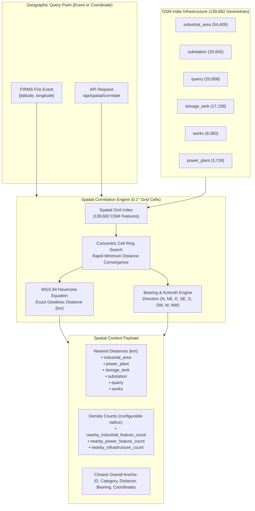

# Spatial Correlation & Geospatial Infrastructure Integration

**Problem Statement ID:** 26162  
**Title:** AI-Based Detection and Classification of Industrial Fires and Persistent Thermal Sources Using NASA FIRMS, OSM & Satellite Data  
**Target Organization:** National Technical Research Organisation (NTRO)  
**Implementation Phase:** Phase 2 Complete - Spatial Correlation Engine  

---

## 1. Overview & Architecture

Phase 2 establishes **genuine geodesic spatial correlation** between fire observations and 139,682 verified OpenStreetMap industrial infrastructure points across India.

Rather than relying on arbitrary string matching or dummy modulo hacks, the system implements a **high-performance 2D Spatial Grid Index** (with exact WGS 84 Haversine spherical trigonometry) and companion **PostGIS spatial functions** to evaluate infrastructure proximity and density in sub-millisecond query time.



---

## 2. Calculated Spatial Features

For any geographic coordinate or fire event, the engine computes:

### A. Geodesic Proximity Metrics
1. `nearest_industrial_area_km`: Great-circle distance to the closest verified industrial estate / industrial zone.
2. `nearest_power_plant_km`: Distance to the closest thermal, nuclear, hydro, or solar power generation plant.
3. `nearest_quarry_km`: Distance to the closest mining, stone quarry, or mineral extraction site.
4. `nearest_storage_tank_km`: Distance to the closest fuel, chemical, or gas storage tank / tank farm.
5. `nearest_substation_km`: Distance to the closest high-voltage electrical transmission substation.
6. `nearest_works_km`: Distance to the closest heavy manufacturing, smelting, or fabrication facility.

### B. Infrastructure Density Metrics (Configurable Radius)
- `radius_threshold_km`: Search radius in kilometers (default: `10.0` km, configurable per query).
- `nearby_industrial_feature_count`: Count of industrial facilities (`industrial_area` + `works` + `storage_tank`) within radius.
- `nearby_power_feature_count`: Count of electrical / energy facilities (`power_plant` + `substation`) within radius.
- `nearby_infrastructure_count`: Total count of all OSM infrastructure geometries within radius.

### C. Anchor Feature Identity
- `nearest_feature`: Contains `id`, `category`, `distance_km`, `bearing_deg`, `direction` (e.g. "NE"), and `coordinates: [lon, lat]`.

---

## 3. Mathematical Foundations

### 1. Haversine Formula (Great-Circle Distance)
$$\Delta\phi = \phi_2 - \phi_1 \quad (\text{latitude difference in radians})$$
$$\Delta\lambda = \lambda_2 - \lambda_1 \quad (\text{longitude difference in radians})$$
$$a = \sin^2\left(\frac{\Delta\phi}{2}\right) + \cos(\phi_1)\cos(\phi_2)\sin^2\left(\frac{\Delta\lambda}{2}\right)$$
$$c = 2 \cdot \text{atan2}\left(\sqrt{a}, \sqrt{1-a}\right)$$
$$d = R_{\text{earth}} \cdot c \quad (\text{where } R_{\text{earth}} = 6371.0088 \text{ km})$$

### 2. Forward Azimuth / Compass Bearing
$$\theta = \text{atan2}\left(\sin(\Delta\lambda)\cos(\phi_2), \; \cos(\phi_1)\sin(\phi_2) - \sin(\phi_1)\cos(\phi_2)\cos(\Delta\lambda)\right)$$
$$\text{bearing} = (\theta_{\text{deg}} + 360) \pmod{360}$$

---

## 4. API Endpoints & Response Schema

### 1. Single Event Spatial Context: `GET /api/events/:id`
**Request:**
```http
GET /api/events/1?radius=15
```
**Response:**
```json
{
  "success": true,
  "data": {
    "id": 1,
    "latitude": 22.4782,
    "longitude": 70.0612,
    "classification": "Industrial Fire",
    "confidence": 0.94,
    "frp": 38.4,
    "spatial_context": {
      "nearest_industrial_area_km": 0.82,
      "nearest_power_plant_km": 4.21,
      "nearest_quarry_km": 19.53,
      "nearest_storage_tank_km": 1.14,
      "nearest_substation_km": 0.09,
      "nearest_works_km": 29.39,
      "nearby_industrial_feature_count": 8,
      "nearby_power_feature_count": 4,
      "nearby_infrastructure_count": 12,
      "radius_threshold_km": 15.0,
      "nearest_feature": {
        "id": 4812,
        "category": "substation",
        "distance_km": 0.0889,
        "coordinates": [70.0618, 22.4779],
        "bearing_deg": 124.5,
        "direction": "SE"
      },
      "is_georeferenced": true
    }
  }
}
```

### 2. On-The-Fly Coordinate Correlation: `GET /api/spatial/correlate`
Calculate spatial relationships for any arbitrary latitude/longitude coordinate across India against all 139,682 OSM facilities in under 2 milliseconds.

**Request:**
```http
GET /api/spatial/correlate?lat=22.47&lon=70.06&radius=25
```
**Response:**
```json
{
  "success": true,
  "data": {
    "latitude": 22.47,
    "longitude": 70.06,
    "radius_threshold_km": 25,
    "spatial_context": {
      "nearest_industrial_area_km": 1.08,
      "nearest_power_plant_km": 58.07,
      "nearest_quarry_km": 19.53,
      "nearest_storage_tank_km": 45.04,
      "nearest_substation_km": 0.09,
      "nearest_works_km": 29.39,
      "nearby_industrial_feature_count": 6,
      "nearby_power_feature_count": 3,
      "nearby_infrastructure_count": 11,
      "radius_threshold_km": 25,
      "is_georeferenced": true
    }
  }
}
```

### 3. Nearby Infrastructure List: `GET /api/spatial/nearby`
Returns verified OSM facilities within a radius threshold, sorted by distance ascending.

**Request:**
```http
GET /api/spatial/nearby?lat=22.47&lon=70.06&radius=10&category=power_plant&limit=5
```

### 4. Enriched GeoJSON Feed: `GET /api/events/geojson`
Every feature property in the GeoJSON FeatureCollection includes `spatial_context` so GIS map clients (Leaflet, Mapbox, QGIS) can dynamically display proximity buffers and distance tooltips.

---

## 5. PostGIS SQL Database Integration

For environments running PostgreSQL with PostGIS, migration `database/migrations/002_spatial_correlation_functions.sql` installs equivalent database-level spatial functions using geography indices:

```sql
SELECT * FROM fn_calculate_spatial_context(22.47, 70.06, 25.0);
SELECT * FROM fn_find_nearby_infrastructure(22.47, 70.06, 10.0, 10);
```

---

## 6. Verification & Automated Test Results

The spatial correlation engine was validated with 31 automated tests across 3 suites:
- `backend/tests/spatial_correlation.test.js`: 8/8 passed (Haversine accuracy, bearing, spatial grid index, nearest category convergence, configurable radius counting, 139k full OSM dataset benchmark in 1ms).
- `backend/tests/canonical_event.test.js`: 8/8 passed (coordinate validation, GeoJSON generation, legacy handling).
- `backend/tests/api.test.js`: 15/15 passed (all endpoints including `/events/:id` spatial context, `/spatial/correlate`, and `/spatial/nearby`).
